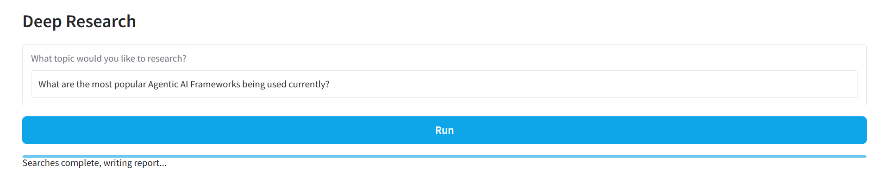
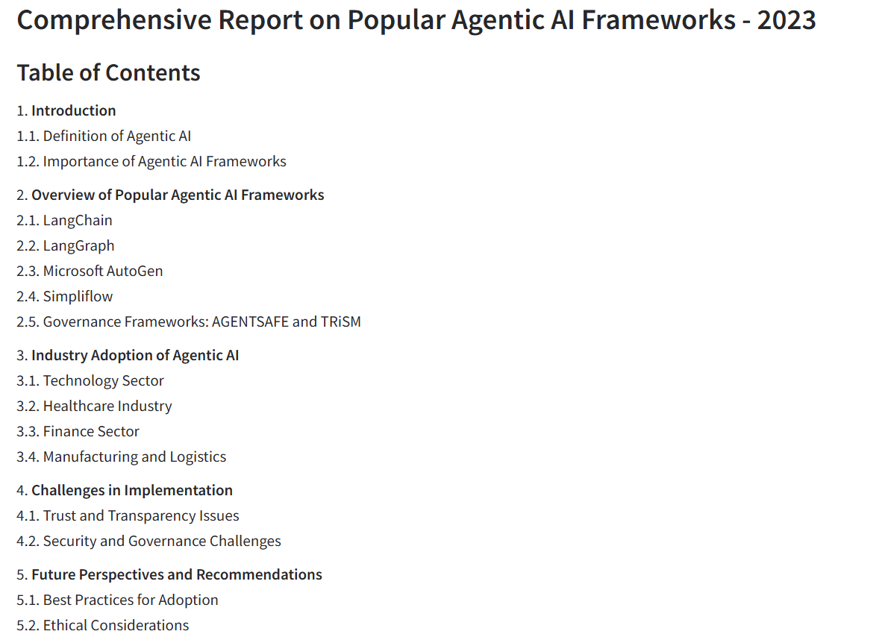
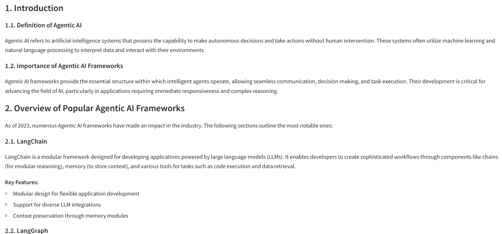
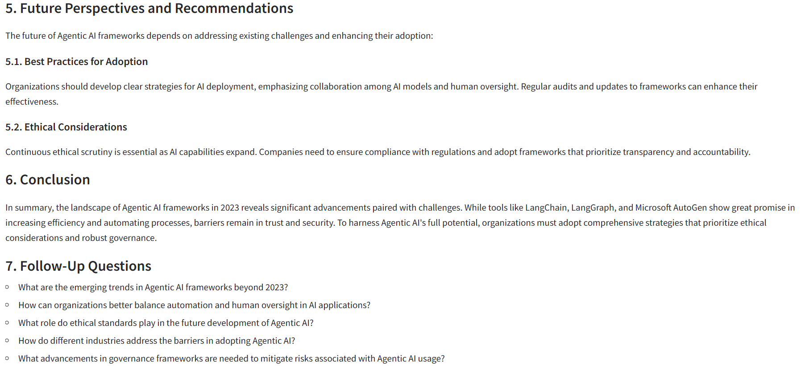

# Deep Research Agentic Web Search Tool

## Overview

This repository contains a **deep research agentic system** built using the **OpenAI SDK**, with a strong focus on the **web search tool** for conducting structured, multi-step research tasks. The system is explicitly **agentic by design**, meaning it is composed of multiple specialised agents that collaborate to plan, search, reason, write, and deliver research outputs.

Rather than a single monolithic pipeline, this project models research as a coordinated effort between autonomous agents, each with a clearly defined role. Together, they replicate how a human research team would decompose a question, investigate sources, synthesise findings, and communicate results.

---

## Key Features

* **OpenAI SDK integration** with web search capabilities
* **Iterative research workflow** that refines queries as new information is discovered
* **Structured final outputs** suitable for reports, briefs, or knowledge synthesis
* **Live progress logging** so users can see the research unfolding in real time
* **User-friendly landing page** designed to avoid idle or static waiting states

---

## Tech Stack

* **Python**
* **OpenAI SDK**
* **Web Search Tool**
* **Gradio** for building the interactive frontend and streaming live agent logs
* **Frontend UI** for live logging and result display

---

## How It Works

The system is implemented as a **agentic multi-agent research pipeline**, where each agent has a clear, well-scoped responsibility. These agents are orchestrated by a central research manager and communicate asynchronously.

At a high level, the workflow is:

1. User submits a research query via the UI
2. A planning agent determines what searches are needed
3. A search agent performs multiple web searches in parallel
4. A writer agent synthesises findings into a long-form report
5. An email agent optionally sends the final report
6. Live logs are streamed throughout the process

---

## Code Architecture

### 1. User Interface (`deep_research.py`)

This file defines the **Gradio-based landing page**, built using the **Gradio framework** for rapid prototyping and interactive ML interfaces.

Key responsibilities:

* Accepts a research query from the user
* Triggers the research pipeline asynchronously
* Streams intermediate logs and the final report back to the UI

Gradio enables real-time streaming of outputs, making it well-suited for long-running agentic workflows. The UI is intentionally designed to feel active rather than static. As the research runs, the interface continuously updates with progress messages and partial outputs, giving users visibility into what the system is doing at each stage.

---

### 2. Research Orchestration (`research_manager.py`)

The `ResearchManager` class is the core coordinator of the system.

It:

* Creates a traceable research session
* Plans searches using the planner agent
* Executes searches concurrently
* Invokes the writer agent to generate the final report
* Sends the report via email using the email agent
* Streams progress updates back to the UI

Each major step yields status messages so the frontend can display live progress logs while the research is running.

---

### 3. Planning Agent (Research Planner Agent) (`planner_agent.py`)

The planner agent is responsible for **research decomposition**.

Given a high-level query, it:

* Breaks the topic into multiple targeted web searches
* Provides reasoning for why each search is relevant
* Outputs a structured search plan using Pydantic models

This step ensures the system performs deliberate, coverage-oriented research instead of a single broad search.

---

### 4. Search Agent (Web Research Agent) (`search_agent.py`)

The search agent performs the actual web research.

Key characteristics:

* Uses the OpenAI Web Search Tool
* Executes searches based on the planner's output
* Produces concise, information-dense summaries
* Ignores fluff and focuses on signal

Multiple searches are executed **in parallel**, significantly reducing total research time while maintaining depth.

---

### 5. Writer Agent (Research Synthesis Agent) (`writer_agent.py`)

The writer agent acts as a senior researcher.

It:

* Creates a structured outline for the report
* Synthesises findings across all search results
* Produces a long-form markdown report
* Returns a short executive summary and follow-up research questions

The output is designed to resemble a genuine research brief rather than a short LLM answer.

---

### 6. Email Agent (Delivery Agent) (`email_agent.py`)

The email agent converts the final markdown report into a clean HTML email and sends it via SendGrid.

This enables:

* Automated delivery of research results
* Easy sharing with stakeholders
* Hands-off report distribution

---

## Live Logging and User Experience

A core design choice of this project is to ensure the interface never feels idle.

While research is in progress, the landing page displays **frequent, real-time logs**, such as:

* Search queries being executed
* Intermediate findings
* Reasoning steps and progress updates

This makes the system feel transparent, responsive, and trustworthy, especially for longer research tasks.

---

## Interface Preview

### Landing Page

The landing page allows users to submit a research query and immediately see live progress updates while the system works.

---

### Example Outputs

Below are screenshots from the research outputs generated by the system.

These examples demonstrate the depth, structure, and clarity of the final research responses.
